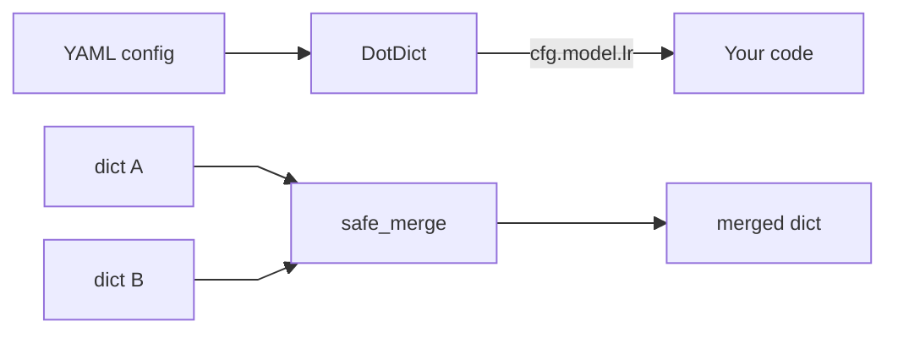
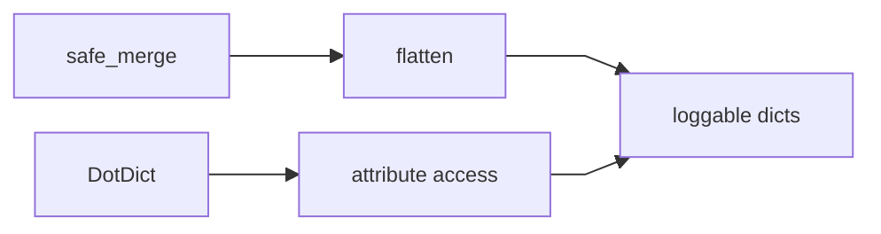

# scitex-dict

<p align="center">
  <a href="https://scitex.ai">
    
  </a>
</p>

<p align="center"><b>Dictionary utilities — DotDict, safe_merge, flatten, listed_dict, replace.</b></p>

<p align="center">
  <a href="https://scitex-dict.readthedocs.io/">Full Documentation</a> · <code>uv pip install scitex-dict[all]</code>
</p>

<!-- scitex-badges:start -->
<p align="center">
  <a href="https://pypi.org/project/scitex-dict/"></a>
  <a href="https://pypi.org/project/scitex-dict/"></a>
  <a href="https://scitex-dict.readthedocs.io/en/latest/"></a>
</p>
<p align="center">
  <a href="https://github.com/ywatanabe1989/scitex-dict/actions/workflows/pytest-matrix-on-ubuntu-py3-11-3-12-3-13.yml"></a>
  <a href="https://github.com/ywatanabe1989/scitex-dict/actions/workflows/import-smoke-on-ubuntu-py3-12.yml"></a>
  <a href="https://codecov.io/gh/ywatanabe1989/scitex-dict/branch/develop/graph/badge.svg"></a>
</p>
<!-- scitex-badges:end -->

---

## Problem and Solution

| # | Problem | Solution |
|---|---------|----------|
| 1 | **YAML config access ergonomics** — `CONFIG["MODEL"]["hidden_size"]` vs `CONFIG.MODEL.hidden_size` matters in a notebook | **`DotDict`** — attribute-access `dict` subclass with recursive `.x.y.z`; works as a drop-in for the umpteen competing alternatives (addict, easydict, box, dotmap) |
| 2 | **Overwrites** — merges lose info on dup keys. | **`safe_merge`** — duplicate keys raise; `flatten` turns nested dicts into dotted-key single-level for logging/CSV |

## Quick Start

```python
from scitex_dict import DotDict, safe_merge

cfg = DotDict({"model": {"lr": 0.001, "epochs": 100}})
print(cfg.model.lr)              # 0.001

merged = safe_merge({"a": 1}, {"b": 2})
```

## Demo



<p align="center"><sub><b>Figure 1.</b> Config access and safe merge flow.</sub></p>

## Installation

```bash
uv pip install "scitex-dict[all]"
```

<details>
<summary><b>Per-module extras</b></summary>

<br>

| Extra | Pulls in |
|---|---|
| `dev` | pytest, sphinx toolchain |
| `all` | dev (recommended) |

```bash
uv pip install -e ".[dev]"  # editable install
```

</details>

## Architecture

### 1. Attribute access

`DotDict` wraps nested dicts for dotted access while staying a real dict.

### 2. Merge and flatten

`safe_merge` raises on duplicates and `flatten` emits dotted-key views for logging.



<p align="center"><sub><b>Figure 2.</b> Module collaboration from dicts to loggable outputs.</sub></p>

## 1 Interfaces

<details open>
<summary><strong>Python API</strong></summary>

<br>

```python
from scitex_dict import (
    DotDict, flatten, listed_dict, pop_keys,
    replace, safe_merge, to_str,
)

cfg = DotDict({"model": {"lr": 0.001}})
cfg.model.lr                              # 0.001

safe_merge({"a": 1}, {"b": 2})

flatten({"x": {"y": 1, "z": [10, 20]}})   # {"x_y": 1, "x_z_0": 10, ...}

d = listed_dict(["a", "b"])

replace("hello world", {"hello": "hi"})   # "hi world"

to_str({"a": 1, "b": 2})
```

</details>

## Part of SciTeX

`scitex-dict` is part of [**SciTeX**](https://scitex.ai). Install via
the umbrella with `pip install scitex[dict]` to use as
`scitex.dict` (Python) or `scitex dict ...` (CLI).

>Four Freedoms for Research
>
>0. The freedom to **run** your research anywhere — your machine, your terms.
>1. The freedom to **study** how every step works — from raw data to final manuscript.
>2. The freedom to **redistribute** your workflows, not just your papers.
>3. The freedom to **modify** any module and share improvements with the community.
>
>AGPL-3.0 — because we believe research infrastructure deserves the same freedoms as the software it runs on.

## License

AGPL-3.0. See [LICENSE](LICENSE).

---

<p align="center">
  <a href="https://scitex.ai" target="_blank"></a>
</p>
